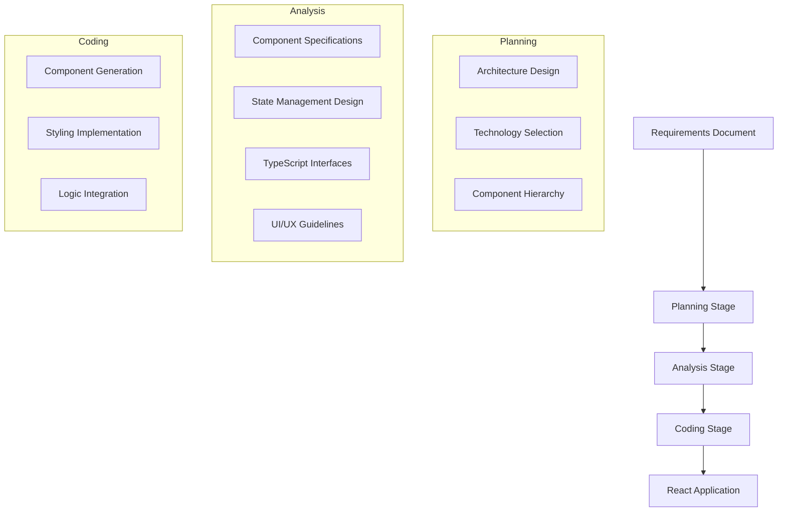

# 🚀 Frontend Generator

A sophisticated AI-powered tool that automatically generates production-ready React applications from requirements documents using a three-stage pipeline approach.

## 📋 Table of Contents

- [Overview](#-overview)
- [Features](#-features)  
- [Architecture](#-architecture)
- [Installation](#-installation)
- [Quick Start](#-quick-start)
- [Usage](#-usage)
- [Examples](#-examples)
- [Prompt Engineering](#-prompt-engineering)
- [Configuration](#-configuration)
- [Contributing](#-contributing)
- [License](#-license)

## 🎯 Overview

The Frontend Generator transforms project requirements into complete React applications through an intelligent three-stage pipeline:

1. **🏗️ Planning Stage**: Architectural planning and technology selection
2. **🔍 Analysis Stage**: Detailed component design and technical specifications  
3. **⚛️ Coding Stage**: Individual component code generation

### Key Benefits

- **Accelerated Development**: Generate complete React apps in minutes, not days
- **Best Practices**: Built-in modern React patterns, TypeScript, and accessibility
- **Consistency**: Standardized code quality across all generated components
- **Flexibility**: Supports various project types from simple dashboards to enterprise platforms
- **Cost-Effective**: Reduces development time by 70-90%

## ✨ Features

### 🎨 Application Types Supported
- **Dashboard Applications**: Analytics, metrics, and data visualization
- **Enterprise Platforms**: Complex business applications with multiple modules
- **Healthcare Management**: HIPAA-compliant medical applications
- **Trading Platforms**: Real-time financial applications
- **Todo/Task Management**: Productivity and project management tools

### 🛠️ Technical Capabilities
- **Modern React**: Functional components with hooks and TypeScript
- **State Management**: Context API, Redux, or Zustand based on complexity
- **Responsive Design**: Mobile-first approach with modern CSS
- **Accessibility**: WCAG-compliant components with proper ARIA labels
- **Code Quality**: ESLint and Prettier compliant code
- **Testing Ready**: Components structured for easy unit testing

### 🤖 AI Models Supported
- **OpenAI**: GPT-4, GPT-3.5, O1, O3 models
- **vLLM**: Support for open-source models via vLLM inference
- **Custom Models**: Extensible for other LLM providers

## 🏗️ Architecture

### Three-Stage Pipeline



### File Structure

```
frontend_generator/
├── codes/                      # Core generation pipeline
│   ├── 1_planning.py          # Planning stage implementation
│   ├── 1_planning_llm.py      # Planning with vLLM support
│   ├── 2_analyzing.py         # Analysis stage implementation  
│   ├── 2_analyzing_llm.py     # Analysis with vLLM support
│   ├── 3_coding.py            # Coding stage implementation
│   ├── 3_coding_llm.py        # Coding with vLLM support
│   └── utils.py               # Shared utilities
├── examples/                   # Sample requirements
│   ├── dashboard_requirements.md
│   ├── simple_todo_requirements.md
│   └── ...
├── scripts/                    # Automation scripts
│   ├── run_frontend.sh        # Full pipeline with OpenAI
│   └── run_frontend_llm.sh    # Full pipeline with vLLM
├── PROMPT_STRUCTURE.md         # Detailed prompt engineering guide
└── requirements.txt            # Python dependencies
```

## 🔧 Installation

### Prerequisites

- Python 3.8+
- OpenAI API key (for OpenAI models)
- CUDA-compatible GPU (optional, for vLLM)

### Setup

1. **Clone the repository**
   ```bash
   git clone https://github.com/yourusername/frontend_generator.git
   cd frontend_generator
   ```

2. **Install dependencies**
   ```bash
   pip install -r requirements.txt
   ```

3. **Set up environment variables**
   ```bash
   export OPENAI_API_KEY="your-openai-api-key"
   ```

4. **Verify installation**
   ```bash
   python codes/utils.py --test
   ```

## 🚀 Quick Start

### Generate Your First App

1. **Prepare requirements** (create `my_app_requirements.md`):
   ```markdown
   # My Todo App
   
   ## Overview
   A simple todo application for task management
   
   ## Features
   - Add, edit, delete tasks
   - Mark tasks as complete
   - Filter by status
   - Responsive design
   ```

2. **Run the generator**:
   ```bash
   # Using OpenAI
   bash scripts/run_frontend.sh \
     --project_name "MyTodoApp" \
     --requirements_path "my_app_requirements.md" \
     --output_dir "output/my_todo_app"
   
   # Using vLLM (with local model)
   bash scripts/run_frontend_llm.sh \
     --project_name "MyTodoApp" \
     --requirements_path "my_app_requirements.md" \
     --output_dir "output/my_todo_app"
   ```

3. **Review generated code**:
   ```bash
   cd output/my_todo_app
   ls -la
   # You'll see: components/, pages/, styles/, types/, etc.
   ```

## 📖 Usage

### Individual Stage Execution

#### Planning Stage
```bash
python codes/1_planning.py \
  --project_name "MyApp" \
  --requirements_path "requirements.md" \
  --gpt_version "gpt-4" \
  --output_dir "output"
```

#### Analysis Stage  
```bash
python codes/2_analyzing.py \
  --project_name "MyApp" \
  --requirements_path "requirements.md" \
  --planning_context "output/planning.json" \
  --output_dir "output"
```

#### Coding Stage
```bash
python codes/3_coding.py \
  --project_name "MyApp" \
  --requirements_path "requirements.md" \
  --analysis_context "output/analysis.json" \
  --output_dir "output"
```

### Advanced Configuration

#### Model Selection
```bash
# Use different OpenAI models
--gpt_version "gpt-4-turbo"
--gpt_version "o1-preview"
--gpt_version "o3-mini"

# Configure vLLM models
--model_path "microsoft/DialoGPT-medium"
--tensor_parallel_size 2
```

#### Requirements Formats
```bash
# Markdown (default)
--requirements_format "markdown"

# JSON structured requirements
--requirements_format "json"

# Plain text
--requirements_format "text"
```

## 📚 Examples

The `examples/` directory contains ready-to-use requirements for different application types:

### Simple Todo App
```bash
python codes/1_planning.py \
  --project_name "SimpleTodo" \
  --requirements_path "examples/simple_todo_requirements.md"
```

### Enterprise Platform
```bash
bash scripts/run_frontend.sh \
  --project_name "EnterprisePlatform" \
  --requirements_path "examples/enterprise_project_platform_requirements.md"
```

### Healthcare Management
```bash
bash scripts/run_frontend.sh \
  --project_name "HealthcareApp" \
  --requirements_path "examples/healthcare_management_requirements.md"
```

### Trading Dashboard
```bash
bash scripts/run_frontend.sh \
  --project_name "TradingDashboard" \
  --requirements_path "examples/trading_platform_requirements.md"
```

## 🎨 Prompt Engineering

The Frontend Generator uses sophisticated prompt engineering with role-based personas and structured instructions. See [PROMPT_STRUCTURE.md](PROMPT_STRUCTURE.md) for detailed information.

### Key Strategies
- **Role-Based Personas**: Different AI personas for each stage
- **Context Preservation**: Requirements and outputs passed through pipeline
- **Temperature Control**: Optimized creativity levels per stage
- **Structured Instructions**: Clear format requirements and quality standards

### Customization
Modify prompts in the individual stage files to:
- Add specific technology preferences
- Include custom coding standards
- Adjust for different project complexities
- Support additional frameworks

## ⚙️ Configuration

### Environment Variables
```bash
# Required
export OPENAI_API_KEY="your-api-key"

# Optional
export VLLM_MODEL_PATH="/path/to/model"
export FRONTEND_GEN_OUTPUT_DIR="/default/output/path"
export FRONTEND_GEN_TEMP=0.3
```

### Model Parameters
```python
# OpenAI Configuration
{
    "model": "gpt-4",
    "temperature": 0.2-0.7,
    "max_tokens": 3000-6000,
    "top_p": 0.95
}

# vLLM Configuration  
{
    "temperature": 0.2-0.7,
    "max_tokens": 3000-6000,
    "top_p": 0.95,
    "tensor_parallel_size": 1
}
```

## 📊 Performance & Cost

### Generation Speed
- **Planning Stage**: 30-60 seconds
- **Analysis Stage**: 45-90 seconds  
- **Coding Stage**: 2-5 minutes per component
- **Total Time**: 5-15 minutes for typical applications

### Cost Estimation (OpenAI)
- **Simple App (5-10 components)**: $2-5
- **Medium App (15-25 components)**: $8-15
- **Complex App (30+ components)**: $20-40

### Optimization Tips
- Use vLLM with local models for cost reduction
- Adjust temperature and max_tokens based on requirements
- Batch similar components in single generation calls

## 🤝 Contributing

We welcome contributions! Please see our contributing guidelines:

1. **Fork the repository**
2. **Create a feature branch**: `git checkout -b feature/amazing-feature`
3. **Make your changes** and add tests
4. **Follow code style**: Use black and isort for formatting
5. **Submit a pull request**

### Development Setup
```bash
# Install development dependencies
pip install -r requirements-dev.txt

# Run tests
pytest tests/

# Format code
black codes/
isort codes/
```

## 📄 License

This project is licensed under the MIT License - see the [LICENSE](LICENSE) file for details.

## 🙏 Acknowledgments

- OpenAI for providing powerful language models
- vLLM team for efficient inference capabilities
- React community for excellent documentation and patterns
- Contributors and users for feedback and improvements

## 📞 Support

- **Documentation**: Check [PROMPT_STRUCTURE.md](PROMPT_STRUCTURE.md) for detailed guides
- **Issues**: Report bugs and request features via GitHub Issues
- **Discussions**: Join our GitHub Discussions for questions and ideas

---

**Happy Coding! 🎉** Generate amazing React applications with the power of AI.