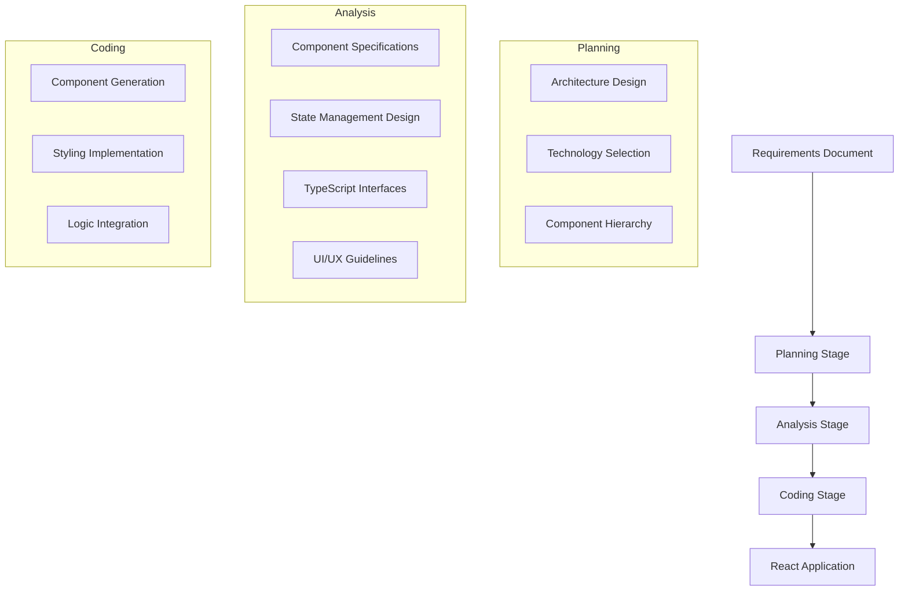

# 🚀 Frontend Generator

A sophisticated AI-powered tool that automatically generates production-ready React applications from requirements documents using a three-stage pipeline approach.

## 📋 Table of Contents

- [Overview](#-overview)
- [Features](#-features)  
- [Architecture](#-architecture)
- [Notebooks](#-notebooks)
- [Installation](#-installation)
- [Quick Start](#-quick-start)
- [Usage](#-usage)
- [Examples](#-examples)
- [Prompt Engineering](#-prompt-engineering)
- [Configuration](#-configuration)
- [Contributing](#-contributing)
- [License](#-license)

## 🎯 Overview

The Frontend Generator transforms project requirements into complete React applications through an intelligent three-stage pipeline:

1. **🏗️ Planning Stage**: Architectural planning and technology selection
2. **🔍 Analysis Stage**: Detailed component design and technical specifications  
3. **⚛️ Coding Stage**: Individual component code generation

### Key Benefits

- **Accelerated Development**: Generate complete React apps in minutes, not days
- **Best Practices**: Built-in modern React patterns, TypeScript, and accessibility
- **Consistency**: Standardized code quality across all generated components
- **Flexibility**: Supports various project types from simple dashboards to enterprise platforms
- **Cost-Effective**: Reduces development time by 70-90%

## ✨ Features

### 🎨 Application Types Supported
- **Dashboard Applications**: Analytics, metrics, and data visualization
- **Enterprise Platforms**: Complex business applications with multiple modules
- **Healthcare Management**: HIPAA-compliant medical applications
- **Trading Platforms**: Real-time financial applications
- **Todo/Task Management**: Productivity and project management tools

### 🛠️ Technical Capabilities
- **Modern React**: Functional components with hooks and TypeScript
- **State Management**: Context API, Redux, or Zustand based on complexity
- **Responsive Design**: Mobile-first approach with modern CSS
- **Accessibility**: WCAG-compliant components with proper ARIA labels
- **Code Quality**: ESLint and Prettier compliant code
- **Testing Ready**: Components structured for easy unit testing

### 🤖 AI Models Supported
- **OpenAI**: GPT-4, GPT-3.5, O1, O3 models
- **vLLM**: Support for open-source models via vLLM inference
- **Custom Models**: Extensible for other LLM providers

## 🏗️ Architecture

### Three-Stage Pipeline



### File Structure

```
frontend_generator/
├── codes/                      # Core generation pipeline
│   ├── 1_planning.py          # Planning stage implementation
│   ├── 1_planning_llm.py      # Planning with vLLM support
│   ├── 2_analyzing.py         # Analysis stage implementation  
│   ├── 2_analyzing_llm.py     # Analysis with vLLM support
│   ├── 3_coding.py            # Coding stage implementation
│   ├── 3_coding_llm.py        # Coding with vLLM support
│   ├── 4_testing.py           # Test generation with OpenAI
│   ├── 4_testing_llm.py       # Test generation with vLLM
│   ├── code_review.py         # AI-powered code review
│   └── utils.py               # Shared utilities
├── examples/                   # Sample requirements
│   ├── dashboard_requirements.md
│   ├── simple_todo_requirements.md
│   └── ...
├── scripts/                    # Automation scripts
│   ├── run_frontend.sh        # Full pipeline with OpenAI
│   └── run_frontend_llm.sh    # Full pipeline with vLLM
├── notebooks/                  # Jupyter notebooks for different platforms
│   ├── Frontend_Generator_Mac_Local.ipynb      # Local execution (Mac optimized)
│   ├── Frontend_Generator_Google_Colab.ipynb   # Google Colab cloud execution
│   ├── Frontend_Generator_Kaggle.ipynb         # Kaggle platform execution
│   ├── requirements-notebooks.txt              # Notebook dependencies
│   ├── setup.py                               # Cross-platform setup script
│   ├── setup.sh                               # Unix setup script
│   ├── setup.bat                              # Windows setup script
│   └── README.md                              # Notebook documentation
├── PROMPT_STRUCTURE.md         # Detailed prompt engineering guide
├── .tool-versions             # asdf version management
└── requirements.txt           # Python dependencies
```

## 📚 Notebooks

### 🎯 Interactive Development Environment

The `notebooks/` directory contains Jupyter notebooks optimized for different platforms, making it easy to run the Frontend Generator in various environments:

#### 🍎 **Mac Local** (`Frontend_Generator_Mac_Local.ipynb`)
Perfect for Mac users with 18GB+ RAM who want complete local control:
- ✅ **Zero API costs** - runs entirely locally using vLLM
- ✅ **Complete privacy** - your code never leaves your machine
- ✅ **MPS acceleration** - optimized for Mac M1/M2 chips
- ✅ **Conservative memory management** - 70% GPU utilization for stability
- ✅ **Model caching** - reuse downloaded models across sessions
- ✅ **Offline capable** - works without internet after initial setup

#### ☁️ **Google Colab** (`Frontend_Generator_Google_Colab.ipynb`)
Ideal for users who want powerful cloud GPUs with Google Drive integration:
- ✅ **Free GPU access** - Access to T4, A100 GPUs 
- ✅ **Google Drive sync** - persistent storage across sessions
- ✅ **No local setup** - runs entirely in your browser
- ✅ **Collaborative** - easy sharing with team members
- ✅ **Automatic downloads** - projects download directly to your computer

#### 🏆 **Kaggle** (`Frontend_Generator_Kaggle.ipynb`)
Best for competition-grade GPUs and extended compute sessions:
- ✅ **Powerful GPUs** - Often better than Colab (T4, P100, A100)
- ✅ **Long sessions** - 12+ hour compute time
- ✅ **Fast storage** - NVMe SSD for quick model loading
- ✅ **Community integration** - share with Kaggle community
- ✅ **Dataset access** - integrate with public datasets

### 🚀 Quick Start with Notebooks

1. **Navigate to notebooks directory**:
   ```bash
   cd notebooks/
   ```

2. **Run setup script**:
   ```bash
   # Cross-platform Python script
   python setup.py
   
   # Or platform-specific scripts
   ./setup.sh          # macOS/Linux
   setup.bat            # Windows
   ```

3. **Start Jupyter**:
   ```bash
   jupyter notebook
   ```

4. **Choose your notebook** based on your environment and follow the interactive instructions.

### 📋 Notebook Features

All notebooks include:
- 🔧 **Automated setup** - dependency installation and environment configuration
- 🤖 **Model selection** - automatic optimization based on your hardware
- 📝 **Interactive requirements** - easy project specification
- ⚡ **Real-time generation** - watch your React app being built
- 🧪 **Testing integration** - validate generated components
- 📥 **Easy downloads** - get your complete project files

For detailed notebook documentation, see [`notebooks/README.md`](notebooks/README.md).
├── .tool-versions             # asdf version management
└── requirements.txt           # Python dependencies
```

## 🔧 Installation

### Prerequisites

- Python 3.8+
- OpenAI API key (for OpenAI models)
- CUDA-compatible GPU (optional, for vLLM)

### Setup Options

#### Option 1: Using asdf (Recommended)

[asdf](https://asdf-vm.com/) is a version manager that allows you to manage multiple runtime versions with a single CLI tool.

1. **Install asdf** (if not already installed)
   ```bash
   # macOS
   brew install asdf
   
   # Ubuntu/Debian
   git clone https://github.com/asdf-vm/asdf.git ~/.asdf --branch v0.14.0
   echo '. ~/.asdf/asdf.sh' >> ~/.bashrc
   echo '. ~/.asdf/completions/asdf.bash' >> ~/.bashrc
   source ~/.bashrc
   
   # For other systems, see: https://asdf-vm.com/guide/getting-started.html
   ```

2. **Clone the repository**
   ```bash
   git clone https://github.com/yourusername/frontend_generator.git
   cd frontend_generator
   ```

3. **Create .tool-versions file**
   ```bash
   echo "python 3.11.7" > .tool-versions
   ```

4. **Install Python plugin and version**
   ```bash
   asdf plugin add python
   asdf install python 3.11.7
   asdf local python 3.11.7
   ```

5. **Create virtual environment and install dependencies**
   ```bash
   python -m venv venv
   source venv/bin/activate  # On Windows: venv\Scripts\activate
   pip install --upgrade pip
   pip install -r requirements.txt
   ```

#### Option 2: Traditional Setup

1. **Clone the repository**
   ```bash
   git clone https://github.com/yourusername/frontend_generator.git
   cd frontend_generator
   ```

2. **Install dependencies**
   ```bash
   pip install -r requirements.txt
   ```

### Common Setup Steps (Both Options)

3. **Set up environment variables**
   ```bash
   export OPENAI_API_KEY="your-openai-api-key"
   ```

4. **Verify installation**
   ```bash
   python codes/utils.py --test
   ```

### asdf Configuration File

For teams using asdf, you can also create a `.asdfrc` file in the project root:

```bash
# .asdfrc
legacy_version_file = yes
```

And optionally add a `.python-version` file for compatibility:

```bash
echo "3.11.7" > .python-version
```

## 🚀 Quick Start

### Generate Your First App

1. **Prepare requirements** (create `my_app_requirements.md`):
   ```markdown
   # My Todo App
   
   ## Overview
   A simple todo application for task management
   
   ## Features
   - Add, edit, delete tasks
   - Mark tasks as complete
   - Filter by status
   - Responsive design
   ```

2. **Run the generator**:
   ```bash
   # Using OpenAI
   bash scripts/run_frontend.sh \
     --project_name "MyTodoApp" \
     --requirements_path "my_app_requirements.md" \
     --output_dir "output/my_todo_app"
   
   # Using vLLM (with local model)
   bash scripts/run_frontend_llm.sh \
     --project_name "MyTodoApp" \
     --requirements_path "my_app_requirements.md" \
     --output_dir "output/my_todo_app"
   ```

3. **Review generated code**:
   ```bash
   cd output/my_todo_app
   ls -la
   # You'll see: components/, pages/, styles/, types/, etc.
   ```

4. **Build and test the generated project**:
   ```bash
   cd output/MyTodoApp_frontend
   npm install
   npm start
   # Application runs at http://localhost:3000
   ```

5. **Generate tests using LLM** (optional):
   ```bash
   # Generate comprehensive test suite
   python ../codes/4_testing.py \
     --project_name "MyTodoApp" \
     --project_path "output/MyTodoApp_frontend" \
     --requirements_path "my_app_requirements.md" \
     --test_types "unit,integration,e2e"
   
   # Run the generated tests
   npm test
   ```

## 📖 Usage

### Individual Stage Execution

#### Planning Stage
```bash
python codes/1_planning.py \
  --project_name "MyApp" \
  --requirements_path "requirements.md" \
  --gpt_version "gpt-4" \
  --output_dir "output"
```

#### Analysis Stage  
```bash
python codes/2_analyzing.py \
  --project_name "MyApp" \
  --requirements_path "requirements.md" \
  --planning_context "output/planning.json" \
  --output_dir "output"
```

#### Coding Stage
```bash
python codes/3_coding.py \
  --project_name "MyApp" \
  --requirements_path "requirements.md" \
  --analysis_context "output/analysis.json" \
  --output_dir "output"
```

#### Testing Stage
```bash
python codes/4_testing.py \
  --project_name "MyApp" \
  --project_path "output/MyApp_frontend" \
  --requirements_path "requirements.md" \
  --test_types "unit,integration" \
  --gpt_version "gpt-4"
```

### Advanced Configuration

#### Model Selection
```bash
# Use different OpenAI models
--gpt_version "gpt-4-turbo"
--gpt_version "o1-preview"
--gpt_version "o3-mini"

# Configure vLLM models
--model_path "microsoft/DialoGPT-medium"
--tensor_parallel_size 2
```

#### Requirements Formats
```bash
# Markdown (default)
--requirements_format "markdown"

# JSON structured requirements
--requirements_format "json"

# Plain text
--requirements_format "text"
```

## 📚 Examples

The `examples/` directory contains ready-to-use requirements for different application types:

### Simple Todo App
```bash
python codes/1_planning.py \
  --project_name "SimpleTodo" \
  --requirements_path "examples/simple_todo_requirements.md"
```

### Enterprise Platform
```bash
bash scripts/run_frontend.sh \
  --project_name "EnterprisePlatform" \
  --requirements_path "examples/enterprise_project_platform_requirements.md"
```

### Healthcare Management
```bash
bash scripts/run_frontend.sh \
  --project_name "HealthcareApp" \
  --requirements_path "examples/healthcare_management_requirements.md"
```

### Trading Dashboard
```bash
bash scripts/run_frontend.sh \
  --project_name "TradingDashboard" \
  --requirements_path "examples/trading_platform_requirements.md"
```

## 🧪 Testing & Validation

After generating your React application, you can build, test, and validate the code using both traditional methods and AI-powered testing.

### Build and Run Generated Project

```bash
# Navigate to generated project
cd output/MyProject_frontend

# Install dependencies
npm install

# Start development server
npm start
# Application runs at http://localhost:3000

# Build for production
npm run build

# Run existing tests (if any)
npm test
```

### AI-Powered Test Generation

The Frontend Generator can also generate comprehensive test suites for your React components using LLM assistance.

#### Generate Test Suite

```bash
# Generate comprehensive tests for all components
python codes/4_testing.py \
  --project_name "MyProject" \
  --project_path "output/MyProject_frontend" \
  --requirements_path "requirements.md" \
  --test_types "unit,integration,e2e" \
  --test_framework "jest" \
  --gpt_version "gpt-4"
```

#### Test Types Supported

- **Unit Tests**: Individual component testing with React Testing Library
- **Integration Tests**: Component interaction and data flow testing
- **E2E Tests**: End-to-end user journey testing with Playwright/Cypress
- **Accessibility Tests**: WCAG compliance and screen reader compatibility
- **Performance Tests**: Load time and rendering performance

#### Sample Test Generation Command

```bash
# Generate specific test types
python codes/4_testing.py \
  --project_name "TodoApp" \
  --project_path "output/TodoApp_frontend" \
  --requirements_path "examples/simple_todo_requirements.md" \
  --test_types "unit,integration" \
  --test_framework "jest" \
  --include_accessibility true \
  --coverage_threshold 80
```

### Code Quality Validation

#### Lint and Format Generated Code

```bash
cd output/MyProject_frontend

# Install development dependencies
npm install --save-dev eslint prettier @typescript-eslint/parser

# Run ESLint
npx eslint src/ --ext .ts,.tsx

# Format with Prettier
npx prettier --write src/

# Type checking
npx tsc --noEmit
```

#### AI Code Review

```bash
# Get AI-powered code review and suggestions
python codes/code_review.py \
  --project_path "output/MyProject_frontend" \
  --review_focus "performance,accessibility,security" \
  --output_format "markdown"
```

### Performance Testing

#### Bundle Analysis

```bash
cd output/MyProject_frontend

# Install bundle analyzer
npm install --save-dev webpack-bundle-analyzer

# Analyze bundle size
npm run build
npx webpack-bundle-analyzer build/static/js/*.js
```

#### Lighthouse Audit

```bash
# Run Lighthouse audit
npm install -g lighthouse

# Audit the running application
lighthouse http://localhost:3000 --output html --output-path ./lighthouse-report.html
```

### Continuous Integration Setup

#### GitHub Actions Workflow

```yaml
# .github/workflows/test-generated-app.yml
name: Test Generated React App

on: [push, pull_request]

jobs:
  test:
    runs-on: ubuntu-latest
    steps:
      - uses: actions/checkout@v3
      - uses: actions/setup-node@v3
        with:
          node-version: '18'
      
      - name: Install dependencies
        run: |
          cd output/MyProject_frontend
          npm ci
      
      - name: Run tests
        run: |
          cd output/MyProject_frontend
          npm test -- --coverage --watchAll=false
      
      - name: Build application
        run: |
          cd output/MyProject_frontend
          npm run build
      
      - name: Run E2E tests
        run: |
          cd output/MyProject_frontend
          npm run test:e2e
```

### Validation Checklist

After generation and testing, verify your React application meets these criteria:

- [ ] **Build Success**: `npm run build` completes without errors
- [ ] **Test Coverage**: Unit tests achieve >80% coverage
- [ ] **Type Safety**: TypeScript compilation passes without errors
- [ ] **Accessibility**: WCAG AA compliance verified
- [ ] **Performance**: Lighthouse score >90 for Performance
- [ ] **Security**: No high-severity vulnerabilities in `npm audit`
- [ ] **Browser Compatibility**: Works in modern browsers (Chrome, Firefox, Safari, Edge)
- [ ] **Responsive Design**: Mobile and desktop layouts render correctly
- [ ] **State Management**: Global and local state behaves as expected
- [ ] **API Integration**: Data fetching and error handling work properly

## 🎨 Prompt Engineering

The Frontend Generator uses sophisticated prompt engineering with role-based personas and structured instructions. See [PROMPT_STRUCTURE.md](PROMPT_STRUCTURE.md) for detailed information.

### Key Strategies
- **Role-Based Personas**: Different AI personas for each stage
- **Context Preservation**: Requirements and outputs passed through pipeline
- **Temperature Control**: Optimized creativity levels per stage
- **Structured Instructions**: Clear format requirements and quality standards

### Customization
Modify prompts in the individual stage files to:
- Add specific technology preferences
- Include custom coding standards
- Adjust for different project complexities
- Support additional frameworks

## ⚙️ Configuration

### Environment Variables
```bash
# Required
export OPENAI_API_KEY="your-api-key"

# Optional
export VLLM_MODEL_PATH="/path/to/model"
export FRONTEND_GEN_OUTPUT_DIR="/default/output/path"
export FRONTEND_GEN_TEMP=0.3
```

### Model Parameters
```python
# OpenAI Configuration
{
    "model": "gpt-4",
    "temperature": 0.2-0.7,
    "max_tokens": 3000-6000,
    "top_p": 0.95
}

# vLLM Configuration  
{
    "temperature": 0.2-0.7,
    "max_tokens": 3000-6000,
    "top_p": 0.95,
    "tensor_parallel_size": 1
}
```

## 📊 Performance & Cost

### Generation Speed
- **Planning Stage**: 30-60 seconds
- **Analysis Stage**: 45-90 seconds  
- **Coding Stage**: 2-5 minutes per component
- **Total Time**: 5-15 minutes for typical applications

### Cost Estimation (OpenAI)
- **Simple App (5-10 components)**: $2-5
- **Medium App (15-25 components)**: $8-15
- **Complex App (30+ components)**: $20-40

### Optimization Tips
- Use vLLM with local models for cost reduction
- Adjust temperature and max_tokens based on requirements
- Batch similar components in single generation calls

## 🤝 Contributing

We welcome contributions! Please see our contributing guidelines:

1. **Fork the repository**
2. **Create a feature branch**: `git checkout -b feature/amazing-feature`
3. **Make your changes** and add tests
4. **Follow code style**: Use black and isort for formatting
5. **Submit a pull request**

### Development Setup
```bash
# Install development dependencies
pip install -r requirements-dev.txt

# Run tests
pytest tests/

# Format code
black codes/
isort codes/
```

## 📄 License

This project is licensed under the MIT License - see the [LICENSE](LICENSE) file for details.

## 🙏 Acknowledgments

- OpenAI for providing powerful language models
- vLLM team for efficient inference capabilities
- React community for excellent documentation and patterns
- Contributors and users for feedback and improvements

## 📞 Support

- **Documentation**: Check [PROMPT_STRUCTURE.md](PROMPT_STRUCTURE.md) for detailed guides
- **Issues**: Report bugs and request features via GitHub Issues
- **Discussions**: Join our GitHub Discussions for questions and ideas

---

**Happy Coding! 🎉** Generate amazing React applications with the power of AI.